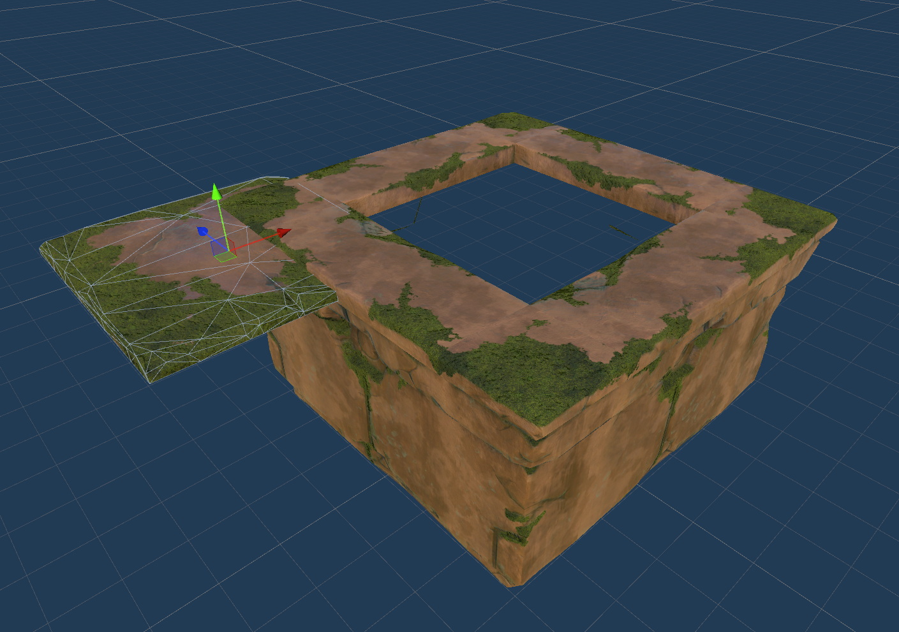

# Unity 3D Video Game Kit Introduction

This folder contains project files for the Unity 3D Video Game Kit Introduction course by GameDev.tv.

https://www.udemy.com/course/gamekit3d/

## Notes

I am neither a beginner programmer nor a stranger to the Unity engine, but I still found this course quite helpful. I haven't touched Unity in several years, so it served as a great refresher on how to navigate the interface and manipulate game objects without having to resort to boring polygons. Something I liked a lot was how some of the challenges assigned by Rick Davidson (the instructor) throughout the lectures made me slow down and think about game design in addition to the primary course material.

### Some things to be aware of
* The course is old--it asks you to install Unity 2019, which isn't even provided in Unity Hub as an option anymore. I used the latest LTS available to me, 2022.3, which worked for the most part. I ran into a problem where I couldn't hide the NavMesh without hiding all gizmos.
* There seems to be a misconfiguration in a few of the Game Kit assets. Certain prefabs that use the `FloorPanel1x1` asset have the `LOD00` mesh translated off center, leading to strange behavior whenever the camera comes near the prefab. I fixed this by resetting the transform of the affected assets and saving them to a new prefab.

## Cloning this repository
Note that there is another `.gitignore` in this project folder. It is there to prevent the entire Game Kit from being saved in the repository, saving over 4 GB. If you would like to clone this repository to your local machine, please download and install the Game Kit into your project from the Unity Asset Store.
